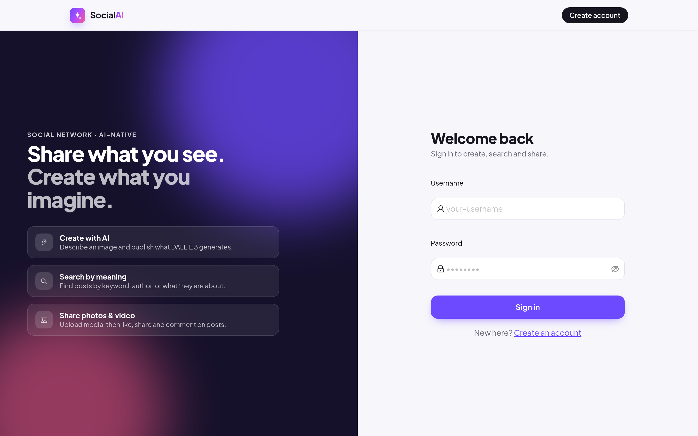

# SocialAI — Frontend

React + TypeScript client for [SocialAI](https://github.com/Rolinmuuu/Social-AI-Backend),
a Go microservices social network with keyword / semantic search, AI image generation
and asynchronous feed fan-out.


| Sign in | Create with AI |
|---|---|
|  |  |

Screenshots use sample posts served by a local mock of the API; the images are
generated abstract artwork, not user content.

## Features

- Sign up / sign in (JWT stored in `localStorage`) on a split-screen auth page
- **Create**: describe an image, the backend generates it with DALL·E 3 and publishes it; example prompts and a three-step explainer
- **Explore**: masonry feed of image and video posts, with a search panel for all posts, caption keywords, one user, or semantic (embedding) search
- New post modal with image / video upload
- Post cards with author avatar, like, share, comments (written this session; the API has no comment-list endpoint yet) and delete with confirmation (the backend only lets authors delete)
- Loading skeletons, empty states, responsive down to phone width

Built with React 19, TypeScript, Ant Design 6 (custom theme) and React Router.

## Run locally

```bash
npm ci
REACT_APP_API_BASE=http://localhost npm start    # backend gateway from docker-compose (nginx on :80)
```

`REACT_APP_API_BASE` defaults to `http://localhost`.

## Test and build

```bash
CI=true npm test -- --watchAll=false
npm run build
```

`src/setupTests.ts` polyfills `matchMedia` and `MessageChannel`, which Ant Design needs
but jsdom does not provide; `package.json` maps a few ESM-only package paths so Jest 27
(from Create React App) can load Ant Design 6.
