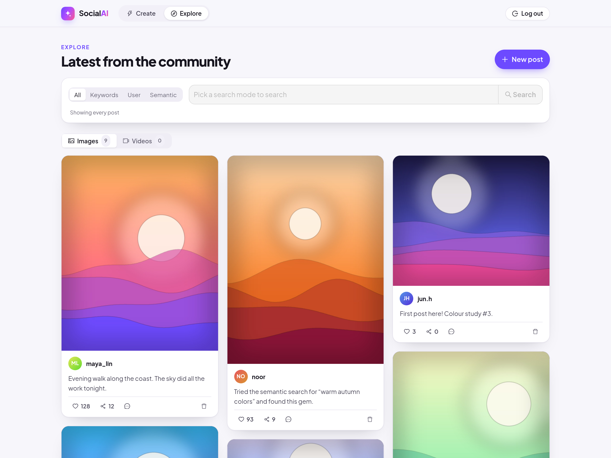
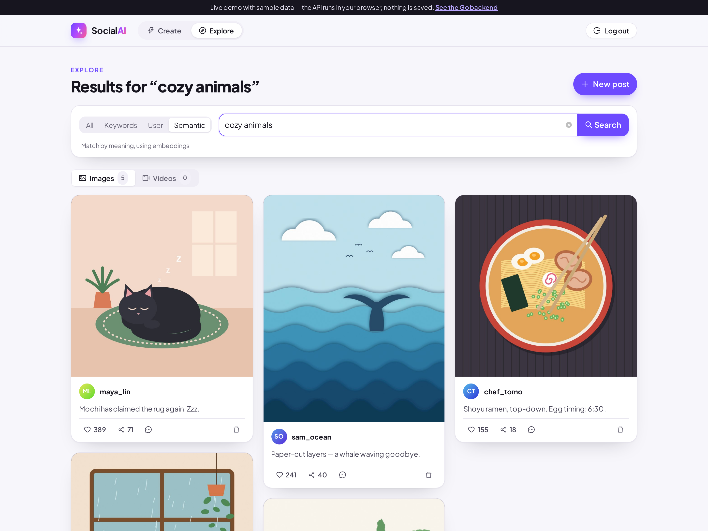
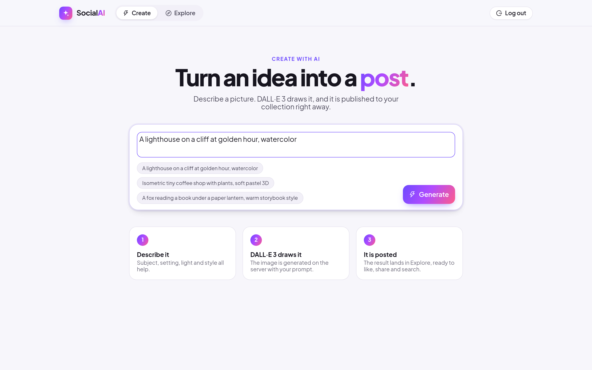

# SocialAI — Frontend

React + TypeScript client for [SocialAI](https://github.com/Rolinmuuu/Social-AI-Backend),
a Go microservices social network with keyword / semantic search, AI image generation
and asynchronous feed fan-out.

**Live demo: https://rolinmuuu.github.io/Social-AI-Frontend/** — sign in with any username and password.
The demo build answers API calls in the browser with sample data (nothing is saved); run the
[Go backend](https://github.com/Rolinmuuu/Social-AI-Backend) for the real thing.



| Semantic search | Create with AI |
|---|---|
|  |  |

Screenshots are from the demo build. The sample artwork (13 illustrations in different styles
and two short loops) is drawn from code in `scripts/demo-art/`; the users and captions are fictional.

## Features

- Sign up / sign in (JWT stored in `localStorage`) on a split-screen auth page
- **Create**: describe an image, the backend generates it with DALL·E 3 and publishes it; example prompts and a three-step explainer
- **Explore**: masonry feed of image and video posts, with a search panel for all posts, caption keywords, one user, or semantic (embedding) search
- New post modal with image / video upload
- Safe retries: uploads and image generation send one `Idempotency-Key` per action and retry
  network errors / `409` with the same key, so a dropped connection never creates a post twice
  (the backend replays the first result; `src/lib/idempotent.ts`, 4 tests)
- Post cards with author avatar, like, share, comments (written this session; the API has no comment-list endpoint yet) and delete with confirmation (the backend only lets authors delete)
- Loading skeletons, empty states, responsive down to phone width

Built with React 19, TypeScript, Ant Design 6 (custom theme), React Router and self-hosted Plus Jakarta Sans.

## Run locally

```bash
npm ci
REACT_APP_API_BASE=http://localhost npm start    # backend gateway from docker-compose (nginx on :80)
```

`REACT_APP_API_BASE` defaults to `http://localhost`.

## Demo build

```bash
REACT_APP_DEMO=true npm start      # UI with the in-browser mock API, no backend needed
```

`src/demo/mockApi.ts` is an axios adapter that serves the same routes and status codes as the
gateway — 401 without a token, 403 when deleting someone else's post, 409 on a second like — so
components are identical in both modes. The demo uses hash routing because GitHub Pages cannot
rewrite deep links. `.github/workflows/pages.yml` publishes it on every push to `main`
(one-time setup: Settings → Pages → Source: GitHub Actions).

## Test and build

```bash
CI=true npm test -- --watchAll=false
npm run build
```

`src/setupTests.ts` polyfills `matchMedia` and `MessageChannel`, which Ant Design needs
but jsdom does not provide; `package.json` maps a few ESM-only package paths so Jest 27
(from Create React App) can load Ant Design 6.
